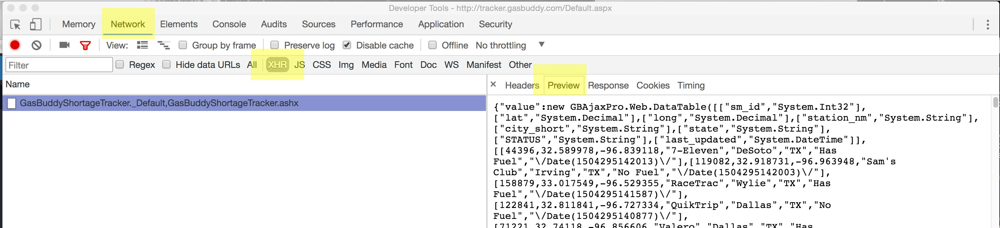
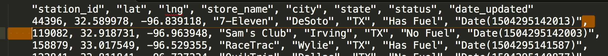

# gas-availability

This is an embeddable graphic built using the [`dmninteractives` Yeoman generator](https://github.com/DallasMorningNews/generator-dmninteractives). It's designed to be embedded using [Pym.js](http://blog.apps.npr.org/pym.js/) as a responsive `iframe`.

## How to update the data

1. Go to [this page](http://tracker.gasbuddy.com/Default.aspx), and zoom in on Dallas until stations begin appearing. Unless you're working with a REALLY large monitor, this area is probably not going to be large enough to cover all of Dallas, so zoom out on your browser a couple of ticks (cmd-) until you have all of Dallas and the surrounding areas.
2. Open up your dev console, click the `Network` tab,, then click `XHR`. Move the map slightly, and click on the last `.ashx` file. Then click `Preview`, and copy the contents.

3. Paste the copied text into a blank file and save it as stations.json onto your desktop. Then, if you're using atom and have the Beautify package, go to Packages > Atom Beautify > Beautify.
4. We want to convert what we have to a CSV and then to JSON, so, you only need the contents of the large array of stations. You can delete everything else.
5. Add this line to the top as our headers:
`"station_id", "lat", "lng", "store_name", "city", "state", "status", "date_updated"`
6. Find all `[`, `]`, `\/` and delete them.
7. The next part is easier to do in Sublime, so, copy what you have, hop over to a blank file in Sublime, and paste.
8. On the first line after the headers, select the trailing comma, the spaces after, the line break and the spaces preceding the next line. Then do Find > Quick Find All, and delete. Then hit a return to put each station on it's own line again.

9. Paste the remainder into this [CSV to JSON converter](http://www.csvjson.com/csv2json), and convert.
10. Copy the outputted JSON and paste back into the stations.json file, then save that into the `dist > js` directory in this repo, save, gulp, update the 'last updated' line in the index.html file, and publish.

## Requirements

- Node - `brew install node`
- Gulp - `npm install -g gulp-cli`

## Local development

#### Installation

1. `npm install` to install development tooling
2. `gulp` to open a local development server

#### What's inside

- `src/index.html` - Graphic HTML markup; there's no Nunjucks, etc. so this is just straight HTML
- `src/embed.html` - A page to test your embed
- `src/js/*.js` - Graphic scripts, written in ES2015 (it'll be transpiled with Babel)
- `src/sass/*.scss` - Graphic styles in SCSS
- `dist/*` - All of the above, transpiled

#### Publishing

`gulp publish` will upload your [`dist/`](dist/) folder to the `embeds/2017/gas-availability/` folder on our interactives S3 bucket.

## Usage

#### Embedding in Serif

The below embed code can be pasted into a Serif "code block":

```html
<div id="embed-gas-availability"></div>

<script src="//pym.nprapps.org/pym.v1.min.js"></script>
<script>new pym.Parent('embed-gas-availability', '//interactives.dallasnews.com/embeds/2017/gas-availability/', {})</script>
```

## Copyright

&copy;2017 The Dallas Morning News
